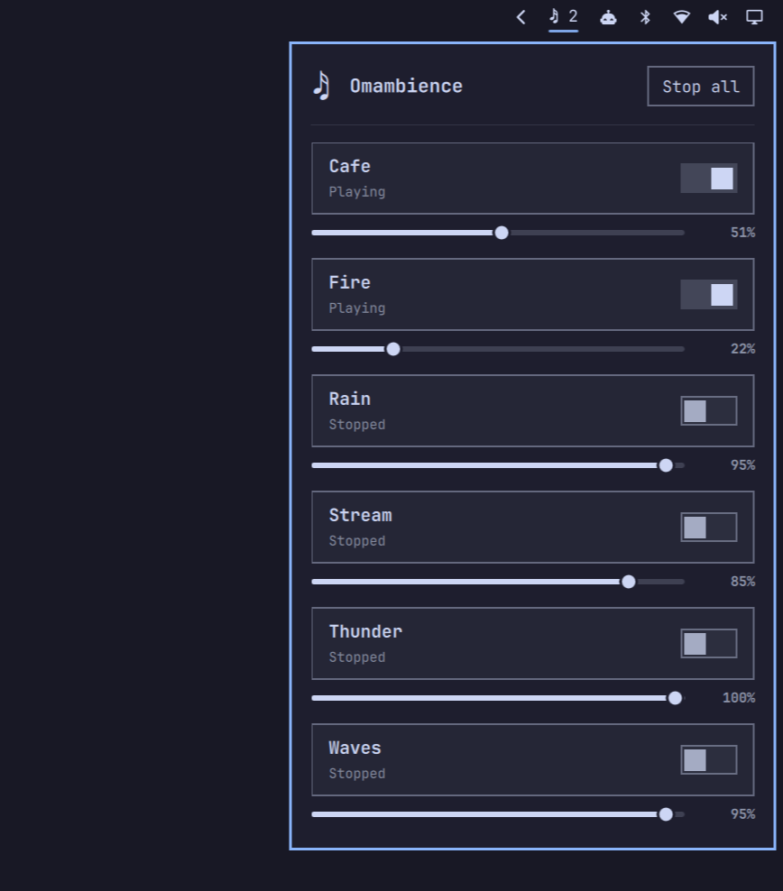

# Omambience

Omambience is an ambient-noise mixer built for **Omarchy Quattro**. It is a
native Omarchy shell bar widget backed by small Bash commands and one looping
`mpv` process per active sound.

- Toggle individual sounds and mix as many as you like.
- Keep a separate, persistent volume for every sound.
- See the active count in the bar and control each sound from the mixer panel.
- Stop the whole mix with one click.
- Control everything from Quattro's Lua keybindings through shell IPC.



Omambience targets Omarchy 4.x only. Waybar and pre-Quattro Hyprland config
are intentionally unsupported.

## Install

Use Quattro's plugin manager:

```sh
omarchy plugin add https://github.com/nwarwick/omambience.git --enable
```

The widget is placed in the right bar section by default. Drag it elsewhere or
use `omarchy bar move nwarwick.omambience`.

Quattro includes Omambience's runtime dependencies (`mpv`, `socat`, and `jq`).
Review third-party plugin code before enabling it.

## Bar widget

The widget always shows a music note. It is dimmed while idle and highlighted
while playing. With several active sounds it includes the count, such as
`♫ 3`.

Left-click the widget to open the native Omarchy mixer panel. Each discovered
sound has an on/off toggle and a `0..100` volume slider, and the panel includes
a stop-all button. Right-click the bar widget for the quick stop-all action.
Set `alwaysShow` to `false` in the bar widget settings if you want it hidden
while idle.

## Optional keybindings

Copy [`snippets/hypr-omambience.lua`](snippets/hypr-omambience.lua) into
`~/.config/hypr/bindings.lua`, then apply and verify it:

```sh
hyprctl reload
hyprctl configerrors
```

| Keys | Action |
|---|---|
| `SUPER+ALT+1..5` | Toggle rain, fire, thunder, waves, or cafe |
| `SUPER+ALT+0` | Stop all sounds |
| `SUPER+CTRL+1..5` | Raise that sound by 5 |
| `SUPER+CTRL+SHIFT+1..5` | Lower that sound by 5 |

The toggle bindings replace Quattro's default `SUPER+ALT+1..5` group-window
selection bindings. If you use window groups, choose different keys instead
of copying the snippet unchanged.

The bindings call the widget's `nwarwick.omambience` IPC target, so they do not
depend on scripts being copied into `~/.local/bin`.

### Migrating an old install

Before enabling the Quattro plugin, stop any pre-Quattro players with the old
`~/.local/bin/omambience-stop-all` command. Replace old Omambience entries in
`~/.config/hypr/bindings.lua` with the Lua snippet above; otherwise both the
old direct commands and the new IPC commands may be bound.

After confirming the plugin works, the old `~/.local/bin/omambience-*` files
and `~/.config/hypr/omambience.conf` are unused and can be removed. Saved
volumes and custom audio already live in the user data locations read by the
new plugin, so they can stay.

## Audio files

The repository includes rain, fire, thunder, waves, cafe, and stream loops.
They are licensed separately from the code; see [`CREDITS.md`](CREDITS.md).
In particular, the bundled fire and waves loops are non-commercial.

Add or replace sounds without editing the installed plugin:

```text
${XDG_DATA_HOME:-~/.local/share}/omambience/audio/<sound>.ogg
```

User files take precedence over bundled files with the same name. Valid sound
names contain letters, numbers, dots, underscores, or hyphens and may not
contain `..`. The widget discovers valid `.ogg` files automatically.

The bundled `rain`, `fire`, `thunder`, `waves`, and `cafe` hotkeys work
immediately. `stream` is available from the mixer panel without a default
hotkey. See
[`audio/README.md`](audio/README.md) for sourcing and encoding guidance.

Bundled loops are gain-calibrated during playback to approximately `-30 LUFS`,
so equal slider values have comparable perceived loudness. User audio is
played at its native level because the plugin cannot know its loudness in
advance.

## Commands and IPC

The installed plugin keeps its commands under:

```text
~/.config/omarchy/plugins/nwarwick.omambience/bin/
```

They can be run directly, but Quattro integrations should use shell IPC:

```sh
omarchy-shell nwarwick.omambience toggle rain
omarchy-shell nwarwick.omambience volume rain +5
omarchy-shell nwarwick.omambience volume rain 60
omarchy-shell nwarwick.omambience stopAll
omarchy-shell nwarwick.omambience status
```

Volumes are clamped to `0..100`.

## How it works

Each active sound runs in its own detached `mpv` session. Omambience records
the process id and uses an exact IPC-socket argument check before treating that
process as its own. Per-sound locks serialize rapid toggle and repeating-volume
commands. PipeWire mixes the resulting streams.

| Data | Location |
|---|---|
| User audio | `${XDG_DATA_HOME:-~/.local/share}/omambience/audio/` |
| PIDs, sockets, locks, volumes | `${XDG_STATE_HOME:-~/.local/state}/omambience/` |
| Plugin checkout | `~/.config/omarchy/plugins/nwarwick.omambience/` |

## Uninstall

```sh
omarchy-shell nwarwick.omambience stopAll
omarchy plugin remove nwarwick.omambience
```

Removal leaves custom audio and saved volumes in place. Delete the two data
directories above if you also want to remove that user-owned state. Remove the
Omambience block from `~/.config/hypr/bindings.lua` if you installed the
optional hotkeys.

## Development

```sh
./tests/test
omarchy plugin validate .
```

## License

Code: MIT (see [`LICENSE`](LICENSE)). Bundled audio files retain their upstream
licenses; see [`CREDITS.md`](CREDITS.md).
